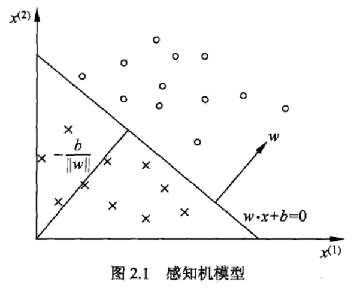

# 第2章-感知机模型-导读{docsify-ignore-all}
&emsp;&emsp;从本章开始，就要学习各种模型了，在学习每个模型的时候，最重要的是要知道这个模型的适用条件、所能解决的问题、对应的统计学习方法三要素（假设空间、策略、求解算法）  
&emsp;&emsp;本章的感知机模型针对的是二分类问题，有一个比较强的假设，要求二分类问题是线性可分的。

## 感知机模型
- 输入空间：$X \subseteq R^{n}$  
- 输入变量：$x \in X$
- 输出空间：$Y=\{+1,-1\}$
- 输出变量：$y \in\{+1,-1\}$
- 假设空间：$f(x)=\text{sign}(w \cdot x+b)$  

**相关说明：**输入变量$x$是一个$n$维向量，$+1$表示该实例是正类，$-1$表示该实例是负类。

&emsp;&emsp;上图表示的是一个输入空间是2维的模型，故$n=2$，图中$x^{(1)}$和$x^{(2)}$表示两个分量，然后根据训练集中每一个实例在这两个输入变量上的取值，将其划分到输入空间中对应的点，实例就是由图中的$\circ$和$\times$表示的，其中$\circ$表示正类，$\times$表示负类。  
&emsp;&emsp;感知机模型的输入变量是线性可分的，也就是说图中的这些点可以用一条直线来分开。在直线上方的是正类，下方的是负类。该直线的表示形式为$w_1x^{(1)}+w_2x^{(2)}+b=0$，该平面中所有的直线，就构成了假设空间。判断实例属于哪一类，根据如下公式：$ w_1x^{(1)}+w_2x^{(2)}+b \left\{ \begin{array}{ll}
\geqslant 0 & \textrm{正类} \\
<0 & \textrm{负类} \\
\end{array} \right.$，假设空间$f(x)=\text{sign}(w \cdot x+b) = \left\{ \begin{array}{ll}
+1 & w \cdot x+b \geqslant 0 \\
-1 & w \cdot x+b<0 \\
\end{array} \right.$，其中$w$是$n$维向量，$w \cdot x= w_1x^{(1)} + w_1x^{(1)} + \cdots + w_nx^{(n)}$  
**总结：** 在感知机模型中，假设空间是关于输入变量$x$的线性函数，再取其符号函数。取符号函数的目的是输出变量是需要分类的，为+1或-1。

## 感知机学习策略
**损失函数：** 误分类点到超平面的总距离$\displaystyle L(w, b)= -\sum_{x_{i} \in M} y_{i}(w \cdot x_{i}+b)$  
**推导：**  
&emsp;&emsp;在感知机学习中，损失函数的定义如下：判断错误的实例到直线的距离，对于任意一点$x_i$到一条直线的距离为$\displaystyle \frac{|w \cdot x_i +b|}{\|w\|} $，其中$\|w\|=\sqrt{w_1^2+\cdots+w_n^2}$，误分类点$x_i$到直线的距离等价与$\displaystyle \frac{-y_{i}(w \cdot x_{i}+b)}{\|w\|}$，对于所有的误分类点，$w \cdot x_{i}+b$是小于0的，所以需要添加-(负号)来保证该公式是大于0的。于是，对于所有的误分类点到超平面的总距离为$\displaystyle \sum_{x_{i} \in M} \frac{-y_{i}(w \cdot x_{i}+b)}{\|w\|}$，由于要算出最小值，可以去掉$\|w\|$，所以可得$\displaystyle -\sum_{x_{i} \in M} y_{i}(w \cdot x_{i}+b)$  
**解释：**  
超平面：在输入变量是2维的时候，用一条直线来分类的，当输入变量是3维的时候，用一个平面类划分，当输入变量是4维的时候，用一个3维的平面来划分，这个时候，该平面被称为超平面。当输入变量是$n$维的时候，用一个$n-1$维的超平面来分类，所以就用超平面来表示分割平面。

## 感知机学习算法
#### 感知机学习算法的原始形式
算法2.1（随机梯度下降法）  
输入：训练数据集$T=\left[(x_1,y_1),\ldots,(x_N,y_N)\right)$，学习率$\eta$  
1. 选取初值$w_0,b_0$，确定了假设空间中的一个备选模型
2. 在训练集中选取数据$(x_i,y_i)$  
3. 如果$y_i(w \cdot x_i +b) \leqslant 0$ $$\begin{aligned} w &:= w+\eta y_{i} x_{i} \\ b &:= b+\eta y_{i} \end{aligned}$$
4. 转至2，直到训练集中没有误分类的点  

输出：$w,b$  
**说明：** $\eta$如果小，这条更新的直线向误分类点移动程度小，如果大的话，移动程度大。

#### 感知机学习算法的对偶形式
$$ 
\begin{array}{c}{\displaystyle f(x)=\text{sign}(\sum_{j=1}^{N} \alpha_{j} y_{j} x_{j} \cdot x+b)} \\ {\alpha=(\alpha_{1}, \cdots, \alpha_{N})^{T}}\end{array}
$$
该假设空间是由$\alpha_j,b$决定的。

算法2.2：  
输入：训练数据集$T=[(x_{1}, y_{1}), \ldots,(x_{N}, y_{N}))$，学习率$\eta$  
1. 初值$\alpha:=0, b :=0$
2. 在训练集中选取数据$(x_i,y_i)$
3. 如果$\displaystyle y_{1}\left(\sum_{j=1}^{N} \alpha_{j} y_{j} x_{j} \cdot x+b\right) \leqslant 0$ $$
\begin{aligned} \alpha_{i} &:=\alpha_{i}+\eta \\ b &:=b+\eta y_{i}\end{aligned}
$$
4. 转至2，直到训练集中没有误分类的点  

输出：$\alpha, b$  

#### 对比两个算法
&emsp;&emsp;对于算法2.2，每次只会更新两个数$\alpha_{i}$和$b$，而算法2.1，每次需要更新一个向量$w$和一个数$b$，相比于算法2.2，需要更新得更多，并且每次都要计算一次$w \cdot x_i$内积，计算量也会很大。算法2.2也需要计算一个内积$x_i \cdot x_j$，但只是当前点的内积，可以提前将所有实例的输入向量的内积都算出来。  
&emsp;&emsp;所以，算法2.2比算法2.1整体上计算量要少一点。